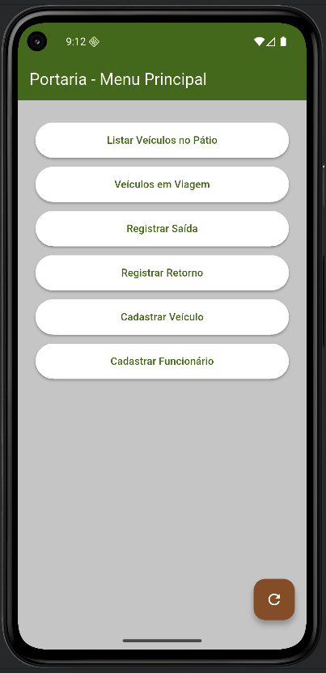

# 📱 Portaria App - Flutter

Aplicativo mobile criado com Flutter para registrar e acompanhar a movimentação de veículos em uma
portaria, consumindo uma API REST desenvolvida em Java + Spring Boot.

---

## 🧱 Tecnologias

- Flutter 3.x
- Dart
- HTTP (para chamadas REST)
- Material Design
- Android SDK (emulador/teste)

---

## 🚀 Funcionalidades

- ✅ Registrar **saída** de veículo com motorista e destino
- ✅ Registrar **retorno** do veículo
- ✅ Listar veículos no pátio
- ✅ Visualizar veículos em viagem
- ✅ Cadastrar novos veículos
- ✅ Cadastrar motoristas (funcionários)
- ✅ Dropdown de seleção de motorista integrado com backend
- ✅ Estilo visual com as cores institucionais da AGT

---

## 🔌 Integração com API

O app consome os seguintes endpoints do backend Java (porta 8081):

| Método | Endpoint                     | Descrição                    |
|--------|------------------------------|------------------------------|
| GET    | /viagens/veiculos?status=... | Lista veículos por status    |
| GET    | /viagens/funcionarios        | Lista motoristas disponíveis |
| POST   | /viagens/saida               | Registra saída de veículo    |
| POST   | /viagens/retorno             | Registra retorno             |
| POST   | /funcionarios                | Cadastra motorista           |
| POST   | /veiculos                    | Cadastra novo veículo        |

---

## 🧭 Telas

- Menu principal com botões
- Registro de saída
- Registro de retorno
- Cadastro de veículo
- Cadastro de funcionário
- Visualização de veículos em viagem

---

## 🖼️ Preview




---

## ⚙️ Como rodar

1. Instale o [Flutter SDK](https://flutter.dev/docs/get-started/install)
2. Rode `flutter pub get`
3. Conecte um emulador Android
4. Execute:

```bash
flutter run
```

> Certifique-se de que o backend esteja rodando em `http://10.0.2.2:8081` se estiver usando emulador
> Android.

---

## ✅ Status

- [x] Aplicação funcional conectada com backend
- [x] Estilização aplicada com cores da empresa
- [x] Navegação entre telas e validação de formulários
- [x] Projeto disponível no GitHub

---

## 👨‍💻 Desenvolvido por

Igor Henrique Dias  
[LinkedIn](https://www.linkedin.com/in/igorhdias)  
README gerado em: 20/07/2025
